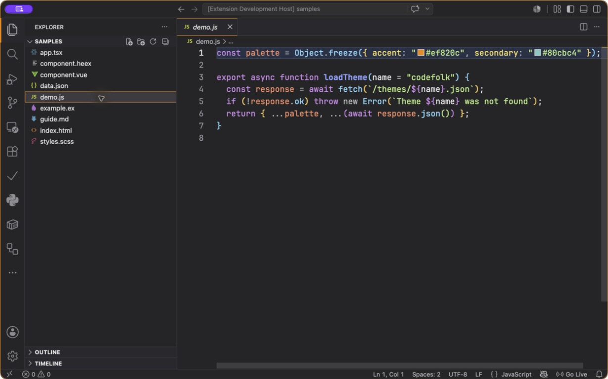
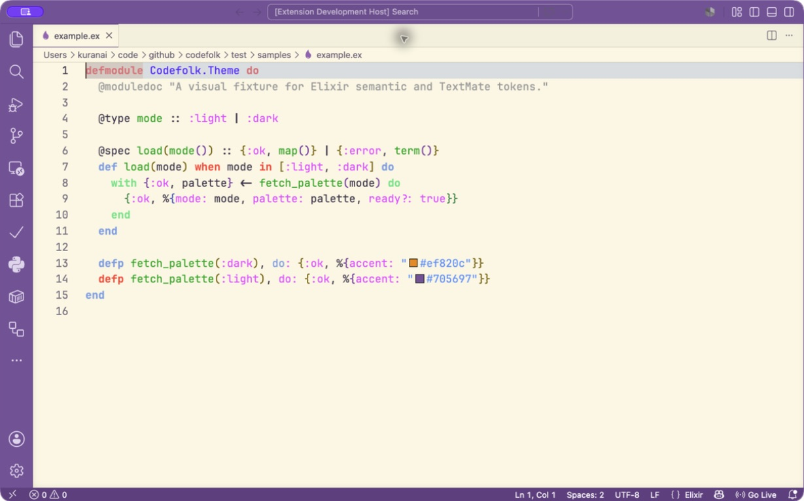

# Codefolk

Codefolk is a warm, modern color theme for Visual Studio Code. It pairs a calm, low-glare dark theme with a warm light theme, using orange, teal, and violet accents without sacrificing everyday readability.





## Themes

- **Codefolk Dark** — a refined charcoal workspace with orange and teal accents.
- **Codefolk Light** — a warm paper-like editor framed by a restrained violet workbench.

Both themes include curated colors for the current VS Code workbench, terminal ANSI colors, notebooks, source control and merge views, testing, debugging, inlay hints, bracket pairs, sticky scroll, and chat surfaces. Semantic highlighting is enabled and complements the TextMate rules.

## Install

After the first Marketplace release, install `kuranai.codefolk` from the Extensions view. For a local build:

```sh
npm ci
npm run package
code --install-extension dist/codefolk-0.1.3.vsix
```

Then open **Preferences: Color Theme** and choose **Codefolk Dark** or **Codefolk Light**.

## Development

Requirements: Node.js 24, npm, and VS Code 1.100 or newer.

```sh
npm ci
npm run generate
npm test
```

The source palettes and mappings live in `src/`; generated files in `themes/` are committed. `npm test` checks deterministic output, TypeScript, the pinned VS Code 1.129.1 workbench color registry, semantic selectors, color formats, and key WCAG AA contrast pairs.

Press `F5` in VS Code to open an Extension Development Host with the fixtures in `test/samples`. Review both themes in editor samples and in Explorer, Search, Source Control/Diff, Terminal, Debug, Testing, Notebook, Settings, Notifications, and Chat views before release.

## Release

1. Update `version` and `CHANGELOG.md`, regenerate themes, and run `npm test`.
2. Create a matching tag such as `v0.1.0`.
3. Approve the protected `marketplace` GitHub environment.

The release workflow builds the VSIX and publishes it using the `VSCE_PAT` environment secret. The `kuranai` Visual Studio Marketplace publisher must be created once before the first release.

## Credits

Codefolk began as a modernized derivative of [escook-theme](https://github.com/liulongbin1314/escook-theme), using its Dark and Light palettes as the visual foundation. The original project is MIT licensed; its notice is retained in [THIRD_PARTY_NOTICES.md](THIRD_PARTY_NOTICES.md).

## License

[MIT](LICENSE)
