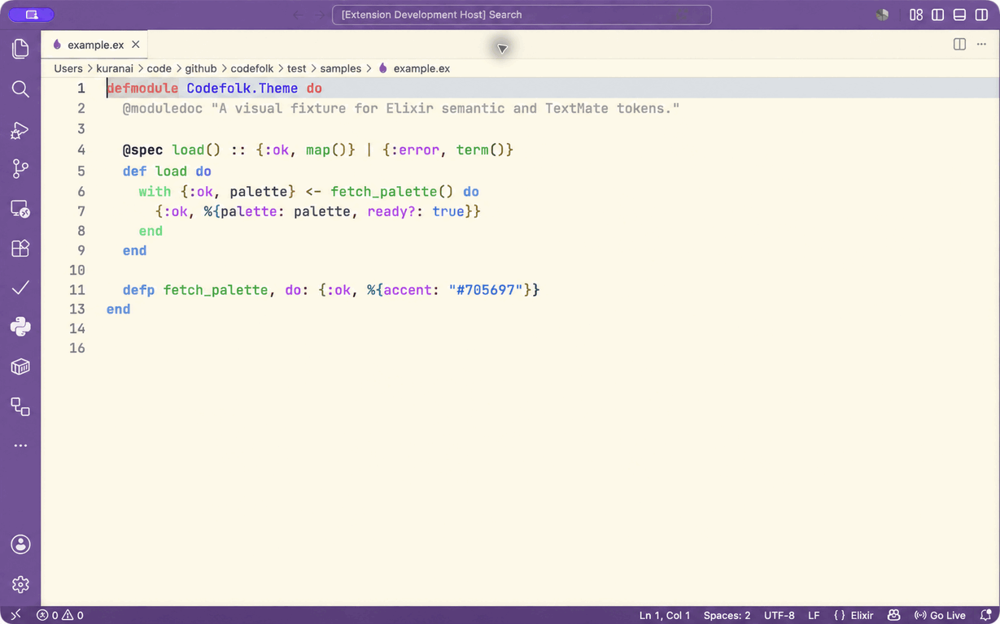

# Codefolk

Codefolk is a warm, modern color theme for Visual Studio Code.



## Theme

**Codefolk** is a warm paper-like editor framed by a restrained violet workbench.

The theme includes curated colors for the current VS Code workbench, terminal ANSI colors, notebooks, source control and merge views, testing, debugging, inlay hints, bracket pairs, sticky scroll, and chat surfaces. Semantic highlighting is enabled and complements the TextMate rules.

## Install

After the first Marketplace release, install `kuranai.codefolk` from the Extensions view. For a local build:

```sh
npm ci
npm run package
code --install-extension dist/codefolk-0.1.4.vsix
```

Then open **Preferences: Color Theme** and choose **Codefolk**.

## Development

Requirements: Node.js 24, npm, and VS Code 1.100 or newer.

```sh
npm ci
npm run generate
npm test
```

The source palettes and mappings live in `src/`; generated files in `themes/` are committed. `npm test` checks deterministic output, TypeScript, the pinned VS Code 1.129.1 workbench color registry, semantic selectors, color formats, and key WCAG AA contrast pairs.

Press `F5` in VS Code to open an Extension Development Host with the fixtures in `test/samples`. Review the theme in editor samples and in Explorer, Search, Source Control/Diff, Terminal, Debug, Testing, Notebook, Settings, Notifications, and Chat views before release.

## Release

Run the release preparation and validation with:

```sh
npm run release -- 0.1.4
```

To create the release commit, tag it, and push both to `main` and the remote, use:

```sh
npm run release -- 0.1.4 --push
```

The script updates `version`, `package-lock.json`, `CHANGELOG.md`, and generated themes, then runs the tests and VSIX packaging. Approve the protected `marketplace` GitHub environment when the tag-triggered workflow pauses.

The release workflow builds the VSIX and publishes it using the `VSCE_PAT` environment secret. The `kuranai` Visual Studio Marketplace publisher must be created once before the first release.

## Credits

Codefolk began as a modernized derivative of [escook-theme](https://github.com/liulongbin1314/escook-theme), using its palette as the visual foundation. The original project is MIT licensed; its notice is retained in [THIRD_PARTY_NOTICES.md](THIRD_PARTY_NOTICES.md).

## License

[MIT](LICENSE)
